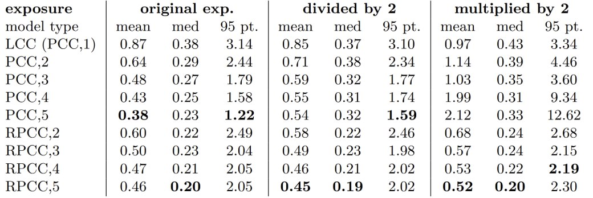
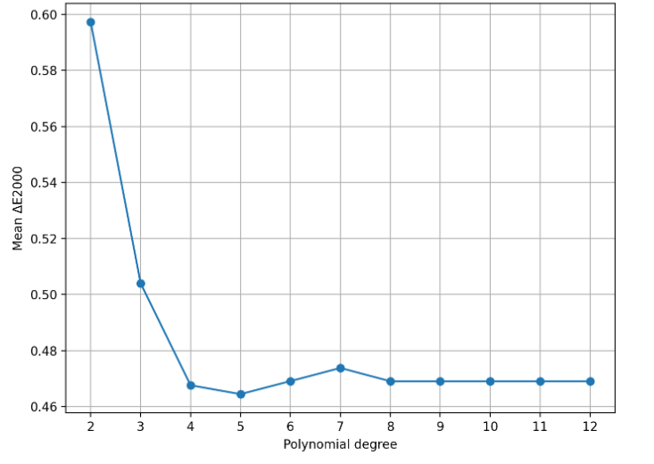

# Colour Correction using Root-Polynomial Regression

This repository contains a Python implementation and evaluation of the color correction method proposed by **Graham D. Finlayson, Michal Mackiewicz, and Anya Hurlbert** in their paper:  
*"Colour Correction using Root-Polynomial Regression"* (IEEE Transactions on Image Processing, 2015).

##  Project Overview

The goal of this project is to map device-dependent camera responses (RGB) to a standard device-independent color space (CIE XYZ). 

A key challenge in color correction is **exposure invariance**. While standard Polynomial Color Correction (PCC) can achieve high accuracy, it fails when the exposure changes (the mapping is not homogeneous). This implementation demonstrates how **Root-Polynomial Color Correction (RPCC)** achieves high accuracy while remaining invariant to changes in exposure.

---

##  Implemented Methods

1.  **LCC (Linear Colour Correction):** A simple $3 \times 3$ matrix transform. Invariant to exposure but limited in accuracy.
2.  **PCC (Polynomial Colour Correction):** Uses higher-order terms (e.g., $R^2, RG, G^2$). Highly accurate for fixed exposure, but fails significantly if the image becomes brighter or darker.
3.  **RPCC (Root-Polynomial Colour Correction):** The method from the paper. It uses root-polynomial terms like $\sqrt{RG}$ or $\sqrt[3]{R^2G}$. It provides the accuracy of polynomials while maintaining the exposure invariance of the linear model.

---

##  Simulation & Dataset

The script simulates a virtual camera pipeline:
* **Illuminant:** CIE D65.
* **Camera Sensors:** Canon 600D spectral sensitivities.
* **Reflectance Data:** Munsell color chips.
* **Evaluation Metric:** CIE Delta E 2000 ($\Delta E_{00}$).

### Exposure Testing
To test the robustness of the methods, the implementation evaluates performance on three datasets:
* **Original:** Standard exposure.
* **x0.5:** Underexposed (simulating a closed aperture or faster shutter).
* **x2.0:** Overexposed (simulating a wider aperture).

---

##  File Structure

* `main.py` — The core script containing feature engineering, model training (least squares), and evaluation.
* `metrics.csv` — Output file containing Mean, Median, and 95th percentile $\Delta E_{00}$ for all methods.
* `*.csv` — Spectral data for sensors, illuminants, and reflectance.

---
## Results

The following table summarizes the performance of each color correction method across different exposure levels. The metrics used are the Mean, Median, and 95th percentile of the CIE Delta E 2000 ($\Delta E_{00}$) error.

This section analyzes how increasing the complexity of the model affects the color transformation accuracy.
